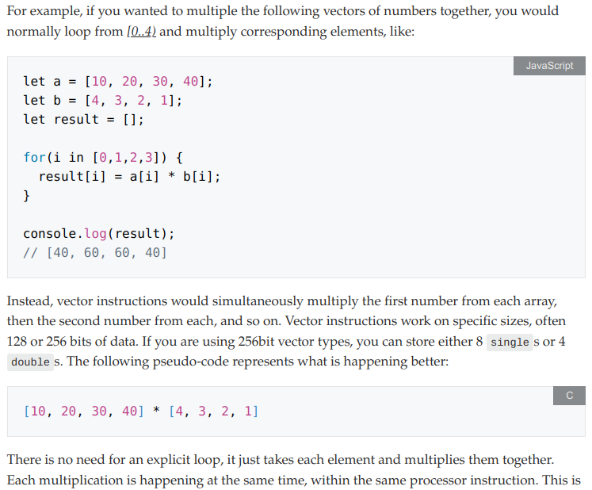
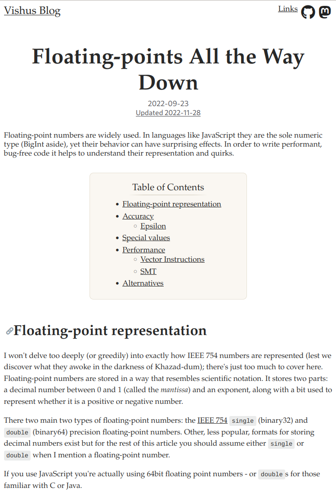
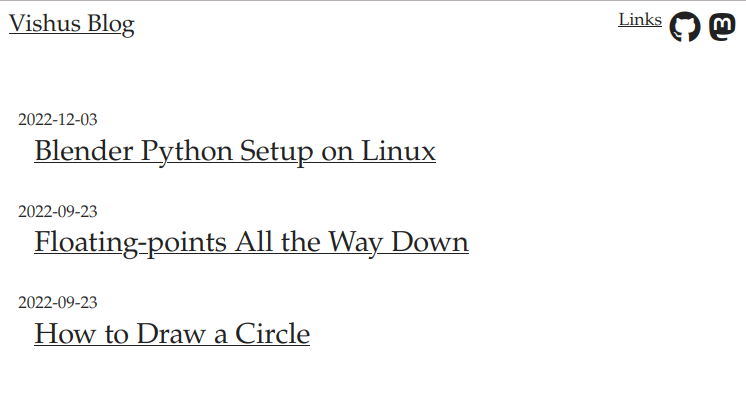

# Vishus Theme for Zola

A configurable and ready-to-use blog template for [Zola](https://www.getzola.org/).

Demo: [https://vishusandy.github.io](https://vishusandy.github.io)

## Configuration

Everything can be configured in the `[extra]` section of the [`config.toml`](config.toml) file.  Descriptions of each variable are provided there.

## Features

- mobile friendly design
- index.html supports pagination by default
- renders math blocks by default
- includes font-awesome
- conditionally shows created and updated dates
- displays a table of contents by default
- custom syntax highlighting theme for code highlighting
    - displays language type for many languages
- link to git repo to show file history for updated pages
- header displays a specified list of links
- cool "top" link to go back to the top of a page

## Screenshots

Code:

Article:

Index:

